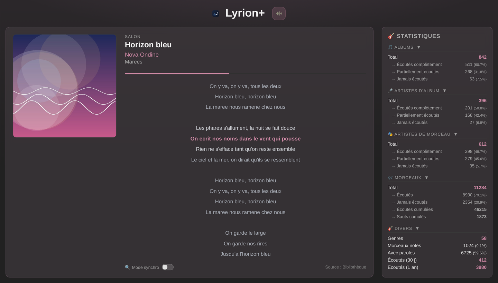

[English](README.md) | [Français](README.fr.md)

# Lyrion Custom Data

Application web Flask pour [Lyrion Music Server](https://github.com/LMS-Community/slimserver) (anciennement Logitech Media Server / Squeezebox Server).

<p>
  
  
</p>

## Fonctionnalités

- **Now Playing** -- Détecte automatiquement le lecteur en cours de lecture et affiche sa piste (pochette, titre, artiste, album), rafraîchi via l'API JSON-RPC de Lyrion. La couleur d'accent s'adapte automatiquement à la pochette.
- **Paroles synchronisées** -- Les paroles avec timestamps LRC sont affichées ligne par ligne avec surlignage et défilement automatiques synchronisés à la lecture, façon karaoké.
- **Recherche web de paroles** -- Quand la bibliothèque n'a pas de paroles (synchronisées), un contrôle segmenté permet de chercher sur le web (LRCLIB, Musixmatch, Genius) à la demande ou automatiquement pour chaque morceau.
- **Statistiques de la bibliothèque** -- Albums, artistes, morceaux joués/non joués, genres, notes, paroles, vélocité d'écoute sur 30 jours.
- **Serveur de fichiers** -- Sert les fichiers depuis un répertoire configurable.

## Structure du projet

```
├── app.py                                 # Point d'entrée Flask (factory)
├── config.py                              # Configuration centralisée (env vars)
├── i18n.py                                # Traductions FR/EN de l'interface
├── requirements.txt                       # Dépendances Python (application web)
├── requirements-cli.txt                   # Dépendances Python (scripts/ uniquement)
├── docker-compose.yml                     # Déploiement via Docker
├── docker-compose.override.yml.example    # Modèle de personnalisation Compose locale
├── .env.example                           # Modèle de configuration
├── routes/
│   ├── nowplaying.py                      # Routes : /, /now-playing.json, /cover, /lyrics.json
│   └── custom.py                          # Route : /files/<path>
├── services/
│   ├── lyrion.py                          # Client JSON-RPC Lyrion
│   ├── database.py                        # Accès SQLite (paroles, stats)
│   ├── lyrics.py                          # Recherche web de paroles (LRCLIB, Musixmatch, Genius)
│   └── tags.py                            # Lecture/écriture des paroles dans les tags audio
├── templates/
│   └── nowplaying.html                    # Dashboard principal
├── static/                                # CSS, JS, icônes
├── scripts/
│   ├── embed_lyrics.py                    # Intègre les paroles web dans les tags des fichiers
│   └── embed_lyrics_cron.sh               # Wrapper cron : ne retague que les fichiers modifiés
├── tests/
└── docs/screenshots/                      # Captures d'écran du README
```

## Pré-requis

- Python 3.12+
- Un serveur Lyrion Music Server accessible
- Le plugin [Alternative Play Count](https://github.com/AF-1/lms-alternativeplaycount) installé sur Lyrion

## Installation

### Avec Docker (recommandé)

```bash
cp .env.example .env
# Éditer .env avec vos valeurs
docker compose up -d
```

### Personnalisation locale Docker Compose

Pour ajouter des services ou des options locales sans polluer les changements Git, copiez le modèle d'override :

```bash
cp docker-compose.override.yml.example docker-compose.override.yml
# Éditer docker-compose.override.yml selon vos besoins
docker compose up -d
```

Docker Compose charge automatiquement `docker-compose.override.yml` en complément du fichier principal.

### Sans Docker

```bash
pip install -r requirements.txt
cp .env.example .env
# Éditer .env avec vos valeurs
source .env
python app.py
```

L'application est accessible sur `http://localhost:1111`.

## Configuration

| Variable | Description | Défaut |
|---|---|---|
| `LYRION_HOST` | URL du serveur Lyrion (ex: `https://lyrion.local:9000`) | -- |
| `DB_PATH` | Chemin absolu vers la base SQLite de Lyrion | -- |
| `DB_PERSIST_PATH` | Chemin absolu vers la base persistante de Lyrion | -- |
| `SECRET_KEY` | Clé secrète Flask | `supersecretkey` |
| `CUSTOM_DATA_DIR` | Répertoire des fichiers générés | `/opt/scripts/custom_data` |
| `HOST` | Adresse d'écoute | `0.0.0.0` |
| `PORT` | Port d'écoute | `1111` |

## Endpoints

| Méthode | Route | Description |
|---|---|---|
| GET | `/` | Dashboard principal (now playing + stats) |
| GET | `/now-playing.json` | État live de la piste du lecteur en cours de lecture, détecté automatiquement (JSON) |
| GET | `/files/<path>` | Sert un fichier depuis le répertoire custom data |

## Scripts

### Intégrer les paroles dans les fichiers (`scripts/embed_lyrics.py`)

Parcourt un dossier (ou des fichiers), récupère les paroles auprès des fournisseurs web et les écrit dans le tag *lyrics* de chaque morceau. Lyrion n'est jamais sollicité : lancez le script quand vous voulez, Lyrion prendra les changements au prochain scan. La configuration (`.env`) est lue automatiquement.

```bash
python scripts/embed_lyrics.py /chemin/vers/musique [options]
# Les jokers shell fonctionnent, même entre guillemets :
python scripts/embed_lyrics.py "/chemin/vers/musique/A*" /chemin/vers/musique/B*
```

| Option | Description |
|---|---|
| `--force` | Réécrit le tag même si des paroles sont déjà présentes. |
| `--clear` | Efface le tag existant quand rien n'est trouvé en ligne, pour refléter ce que proposent les fournisseurs. Traite aussi les fichiers déjà taggés (donc une requête web par fichier) ; combinable avec `--force`. |
| `--dry-run` | Affiche ce qui serait fait, sans rien écrire. |
| `--delay 0.5` | Délai (secondes) entre deux requêtes web (défaut : 0.5). |
| `--verbose` | Journalise chaque fichier, y compris ceux ignorés. |

### Cron : ne re-taguer que les fichiers modifiés (`scripts/embed_lyrics_cron.sh`)

Wrapper destiné au cron : il ne passe à `embed_lyrics.py` que les fichiers dont le `ctime` a changé depuis la dernière passe réussie (`find -cnewer`), via un fichier marqueur.

```bash
scripts/embed_lyrics_cron.sh /chemin/vers/musique [MARQUEUR] [-- OPTIONS]
```

- `MARQUEUR` : fichier d'horodatage (défaut : `state/embed_lyrics.last_run` à la racine du repo). Absent → toute la bibliothèque est traitée (première passe).
- Le marqueur est horodaté au **début** de la passe et n'avance qu'**en cas de succès** : un échec ne fait pas avancer la fenêtre, et un fichier modifié pendant la passe est repris au prochain run. `--dry-run` ne fait pas avancer le marqueur.
- Tout ce qui suit `--` est transmis tel quel à `embed_lyrics.py` (ex. `-- --clear --delay 1`).

```cron
30 3 * * * /chemin/vers/custom_data/scripts/embed_lyrics_cron.sh \
  /chemin/vers/musique >> /tmp/embed_lyrics.log 2>&1
```

> Le `ctime` (et non le `mtime`) est utilisé volontairement : il capte aussi les ré-écritures de tags en place et les fichiers copiés en conservant leur `mtime` (`rsync -a`, `cp -p`).

## Licence

Ce projet est distribué sous licence MIT — voir le fichier [LICENSE](LICENSE).
