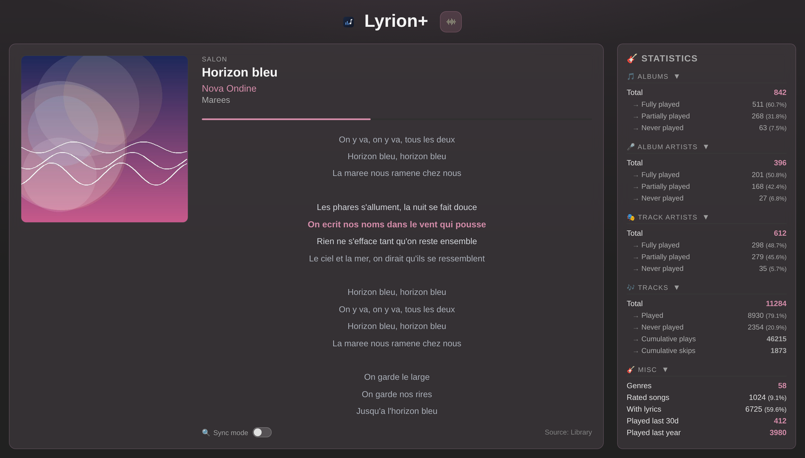
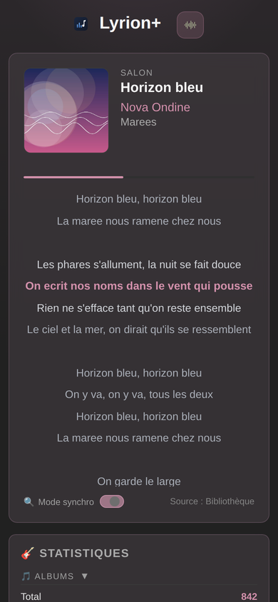

[English](README.md) | [Français](README.fr.md)

# Lyrion Custom Data

A Flask web app for [Lyrion Music Server](https://github.com/LMS-Community/slimserver) (formerly Logitech Media Server / Squeezebox Server).

<p>
  
  
</p>

## Features

- **Now Playing** -- Automatically detects the player currently playing and shows its track (cover art, title, artist, album), refreshed live via Lyrion's JSON-RPC API. The accent color adapts to the cover art automatically.
- **Synced lyrics** -- Lyrics with LRC timestamps are displayed line-by-line with real-time highlighting and auto-scroll synced to playback, karaoke-style.
- **Web lyrics fallback** -- When the library has no (synced) lyrics, a segmented control lets you search the web (LRCLIB, Musixmatch, Genius) on demand or automatically for every track.
- **Library statistics** -- Albums, artists, played/unplayed tracks, genres, ratings, lyrics, 30-day listening velocity.
- **File server** -- Serves files from a configurable directory.

## Project structure

```
├── app.py                                 # Flask entry point (factory)
├── config.py                              # Centralized configuration (env vars)
├── i18n.py                                # FR/EN UI translations
├── requirements.txt                       # Python dependencies (web app)
├── requirements-cli.txt                   # Python dependencies (scripts/ only)
├── docker-compose.yml                     # Docker deployment
├── docker-compose.override.yml.example    # Local Compose customization template
├── .env.example                           # Configuration template
├── routes/
│   ├── nowplaying.py                      # Routes: /, /now-playing.json, /cover, /lyrics.json
│   └── custom.py                          # Route: /files/<path>
├── services/
│   ├── lyrion.py                          # Lyrion JSON-RPC client
│   ├── database.py                        # SQLite access (lyrics, stats)
│   ├── lyrics.py                          # Web lyrics fallback (LRCLIB, Musixmatch, Genius)
│   └── tags.py                            # Read/embed lyrics into audio file tags
├── templates/
│   └── nowplaying.html                    # Main dashboard
├── static/                                # CSS, JS, icons
├── scripts/
│   ├── embed_lyrics.py                    # Embed web lyrics into files' tags
│   └── embed_lyrics_cron.sh               # Cron wrapper: only re-tags changed files
├── tests/
└── docs/screenshots/                      # README screenshots
```

## Requirements

- Python 3.12+
- An accessible Lyrion Music Server
- The [Alternative Play Count](https://github.com/AF-1/lms-alternativeplaycount) plugin installed on Lyrion

## Installation

### With Docker (recommended)

```bash
cp .env.example .env
# Edit .env with your values
docker compose up -d
```

### Local Docker Compose customization

To add services or local options without polluting Git changes, copy the override template:

```bash
cp docker-compose.override.yml.example docker-compose.override.yml
# Edit docker-compose.override.yml to suit your needs
docker compose up -d
```

Docker Compose automatically loads `docker-compose.override.yml` on top of the main file.

### Without Docker

```bash
pip install -r requirements.txt
cp .env.example .env
# Edit .env with your values
source .env
python app.py
```

The app is available at `http://localhost:1111`.

## Configuration

| Variable | Description | Default |
|---|---|---|
| `LYRION_HOST` | Lyrion server URL (e.g. `https://lyrion.local:9000`) | -- |
| `DB_DIR` | Directory containing Lyrion's `library.db` | -- |
| `DB_PERSIST_DIR` | Directory containing Lyrion's `persist.db` | -- |
| `SECRET_KEY` | Flask secret key | `supersecretkey` |
| `CUSTOM_DATA_DIR` | Generated files directory | `/opt/scripts/custom_data` |
| `HOST` | Listen address | `0.0.0.0` |
| `PORT` | Listen port | `1111` |

## Endpoints

| Method | Route | Description |
|---|---|---|
| GET | `/` | Main dashboard (now playing + stats) |
| GET | `/now-playing.json` | Live state of the currently playing track, auto-detected (JSON) |
| GET | `/files/<path>` | Serves a file from the custom data directory |

## Scripts

### Embed lyrics into files (`scripts/embed_lyrics.py`)

Walks a folder (or files), fetches lyrics from web providers and writes them into the *lyrics* tag of each track. Lyrion is never contacted: run the script whenever you want, Lyrion will pick up the changes on its next scan. Configuration (`.env`) is read automatically.

```bash
python scripts/embed_lyrics.py /path/to/music [options]
# Shell globs work, even when quoted:
python scripts/embed_lyrics.py "/path/to/music/A*" /path/to/music/B*
```

| Option | Description |
|---|---|
| `--force` | Rewrites the tag even if lyrics are already present. |
| `--clear` | Erases the existing tag when nothing is found online, to reflect what the providers offer. Also processes already-tagged files (so one web request per file); combinable with `--force`. |
| `--dry-run` | Prints what would be done, without writing anything. |
| `--delay 0.5` | Delay (seconds) between web requests (default: 0.5). |
| `--verbose` | Logs every file, including skipped ones. |

### Cron: only re-tag changed files (`scripts/embed_lyrics_cron.sh`)

A cron-oriented wrapper that only feeds `embed_lyrics.py` the files whose `ctime` changed since the last successful pass (`find -cnewer`), via a marker file.

```bash
scripts/embed_lyrics_cron.sh /path/to/music [MARKER] [-- OPTIONS]
```

- `MARKER`: timestamp file (default: `state/embed_lyrics.last_run` at the repo root). Missing → the whole library is processed (first pass).
- The marker is stamped at the **start** of the pass and only advances **on success**: a failure does not move the window forward, and a file modified during the pass is picked up on the next run. `--dry-run` does not advance the marker.
- Everything after `--` is forwarded as-is to `embed_lyrics.py` (e.g. `-- --clear --delay 1`).

```cron
30 3 * * * /path/to/custom_data/scripts/embed_lyrics_cron.sh \
  /path/to/music >> /tmp/embed_lyrics.log 2>&1
```

> `ctime` (not `mtime`) is used on purpose: it also catches in-place tag rewrites and files copied while preserving their `mtime` (`rsync -a`, `cp -p`).

## License

This project is distributed under the MIT license — see the [LICENSE](LICENSE) file.
